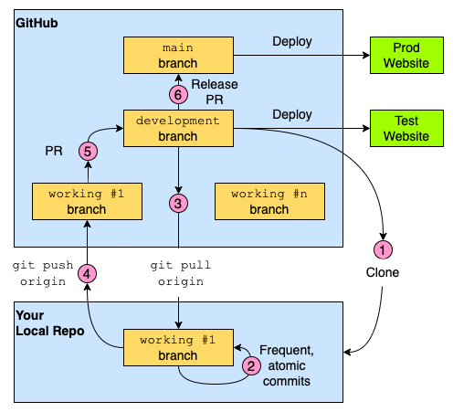

# Team Workflow

## 1. Coding Standards

### 1.1 Code Formatting & Linting

- **Automated tools**:
  - ESLint to handle linting
  - Prettier to handle formatting
- **Git hooks**: Pre-commit hooks automatically format code locally
- **CI integration**: Not currently required

### 1.2 Testing Guidelines

Testing is encouraged but **not mandatory**. While we recognize its necessity, we'll offload that responsibility to those who want to learn it and those who are already comfortable with it.

### 1.3 Code Quality Requirements

- **Variable naming**: Use clear, descriptive names composed of actual words.  
  For example, use `errorCount` instead of `nErr`
- **Error handling**: Implement defensive programming practices to handle errors and edge cases
- **Validation handling**: For example, if the expected input data is an email address, validate that actually looks like one etc
- **Documentation**: Update relevant documentation (including READMEs) to reflect changes

### 1.4 Accessibility Requirements for HTML

All frontend code must meet these accessibility requirements:

- **Responsive design**
- **Semantic HTML**: Using `<header>`, `<nav>`, `<main>`, `<article>`, `<section>`, `<aside>`, and `<footer>` instead of simply `
` or ``
- **Keyboard navigation**: This allows elements to be accessible via keyboard only
- **Alt text**: When applicable, provide descriptive alt text for images and visual content
- **Form accessibility**: Via tabs and ARIA attributes
- **Heading hierarchy**: Use proper heading structure (h1 → h2 → h3, etc and not something like h1 → h3)

## 2. Git Workflow

The [Chingu Git workflow](https://github.com/chingu-voyages/Handbook/blob/main/docs/resources/techresources/gitgithub.md#the-workflow) will be used for version control.

## 3. Naming Conventions

### 3.1 Commit Messages

Follow the mandatory requirements of the [Conventional Commits specification](https://www.conventionalcommits.org/en/v1.0.0/). Please use this [conventional commits cheatsheet](https://gist.github.com/qoomon/5dfcdf8eec66a051ecd85625518cfd13) for easy formatting guidance.

### 3.2 Branch Names

Please use conventional commit types with the format: `<type>/<name>`.

**Examples:**
- `feat/dark-mode`
- `fix/login-validation`
- `docs/api-documentation`

## 4. Deployment

Good chance it will be [Render](https://render.com/) but this may change.

## Citations

This workflow is largely based on an earlier workflow developed by [@snowbytes](https://github.com/snowbytes).